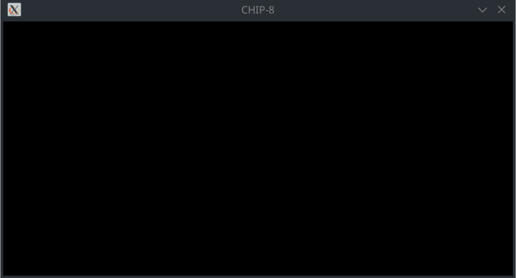

# CHIP-8 Interpreter
A CHIP-8 interpreter written in C++ and SDL2

<p align="center">
  
</p>

## To build
Requires SDL2
```
make
```

## Usage
Drag-and-drop a file into the window to run it

## Keypad
```
CHIP-8                 Keyboard
+---------------+      +---------------+
| 1 | 2 | 3 | C |      | 1 | 2 | 3 | 4 |
|---|---|---|---|      |---|---|---|---|
| 4 | 5 | 6 | D |      | Q | W | E | R |
|---|---|---|---|  ->  |---|---|---|---|
| 7 | 8 | 9 | E |      | A | S | D | F |
|---|---|---|---|      |---|---|---|---|
| A | 0 | B | F |      | Z | X | C | V |
+---------------+      +---------------+
```
